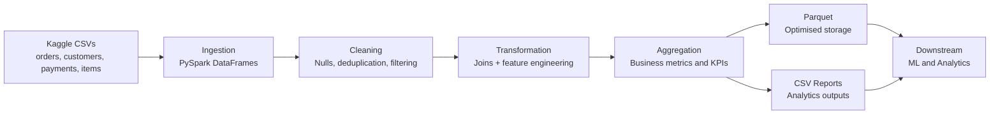

# Scalable E-Commerce ETL Pipeline using PySpark (100K+ Orders)


An end-to-end PySpark ETL pipeline built on the Brazilian E-Commerce
Public Dataset (Olist) with 100k+ orders across multiple relational tables.

## Key Features

- Modular ETL architecture — each stage is a separate, independently runnable script
- Handles multi-table relational data with aggregation before joins to avoid row inflation
- Feature engineering for delivery performance — actual vs estimated delivery, late order flagging
- Master dataset persisted in Parquet format for optimised columnar storage and fast downstream reads
- Repartitioned output for efficient distributed writes across large datasets

## Project Structure
```
ecommerce_etl/
├── data/
│   ├── raw/          # Source CSVs from Kaggle
│   └── output/       # Parquet + CSV outputs
├── src/
│   ├── ingestion.py       # Loads CSVs into Spark DataFrames
│   ├── cleaning.py        # Null handling, deduplication, filtering
│   ├── transformation.py  # Joins, feature engineering, caching
│   ├── aggregation.py     # Business-level aggregations
│   └── main.py            # Orchestrates full pipeline
└── notebooks/
    └── exploration.ipynb  # Initial data exploration
```

## Dataset

Brazilian E-Commerce Public Dataset by Olist — available on Kaggle.
Place the CSV files in `data/raw/` before running.

| Table | Rows |
|---|---|
| Orders | 99,441 |
| Customers | 99,441 |
| Payments | 103,886 |
| Items | 112,650 |

## Data Model

- orders (order_id, customer_id, order_purchase_timestamp, order_delivered_customer_date, order_estimated_delivery_date)
- customers (customer_id, customer_state)
- payments (order_id, payment_value)
- order_items (order_id, price, freight_value)

## Why PySpark?

- Dataset size exceeds 100MB with multiple relational tables
- Efficient distributed joins and aggregations
- Lazy evaluation optimizes execution plan
- Scales beyond single-machine Pandas workflows

## Pipeline Stages

**1. Ingestion** — Loads 4 CSV files into PySpark DataFrames with schema inference.

**2. Cleaning**
- Drops rows with null critical fields
- Removes duplicate orders
- Filters to delivered orders only
- Removes zero-value payments
- Result: 96,478 clean orders

**3. Transformation**
- Aggregates payments per order (handles split payments)
- Aggregates items per order (handles multi-item orders)
- Joins orders + customers + payments + items into master table
- Caches master DataFrame in memory for faster downstream aggregations
- Repartitions output for optimised parallel writes
- Engineers features:
  - `delivery_time_days` — actual days taken to deliver
  - `delivery_delay_days` — days vs estimated delivery date
  - `was_late` — boolean flag for late deliveries
  - `order_value_bucket` — low / medium / high / premium
  - `purchase_year`, `purchase_month` — for trend analysis
- Caches master DataFrame in memory for faster downstream aggregations

**4. Aggregation**
- Revenue by state (total, count, average order value)
- Monthly sales trend (2016–2018)
- Delivery performance by state (avg days, late %)
- Order value distribution by bucket

**5. Output**
- Master cleaned dataset saved as Parquet
- All aggregation reports saved as CSV

## Key Findings

- São Paulo (SP) leads with R$5.77M revenue across 40,501 orders
- SP also has the fastest average delivery at 8.7 days
- 63% of orders fall in the medium value bucket (R$50–200)
- Average late delivery rate across all states is under 10%
- Business grew from 265 orders in Oct 2016 to 1,653 in Feb 2017

## Architecture Diagram


## How to Run
```bash
# 1. Create and activate virtual environment
python -m venv venv
source venv/bin/activate       # Mac/Linux
venv\Scripts\activate          # Windows

# 2. Install dependencies
pip install pyspark pandas pyarrow jupyter

# 3. Add Kaggle CSVs to data/raw/

# 4. Run full pipeline
python src/main.py
```

## Tools Used

| Tool | Purpose |
|---|---|
| PySpark 3.x | Distributed data processing |
| Pandas | Data exploration |
| PyArrow | Parquet file support |
| Jupyter | Initial data exploration |

## Future Improvements

- Integrate with Apache Airflow for pipeline scheduling and monitoring
- Add explicit schema enforcement using `StructType` instead of `inferSchema`
- Write output to a cloud data warehouse such as BigQuery or Redshift
- Build an analytics dashboard using Power BI or Tableau
- Deploy on Databricks for fully managed Spark cluster execution